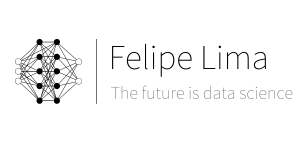

  

This is my repository for data science and data analysis projects.

## Projects:

* **Recommendation System for Medium Posts:** https://bit.ly/314ums7

## About me:

I am a computer scientist from Centro Universitário de João Pessoa, who fell in love with solving problems based on data. My first project in data science was at the time of graduation, where I built a solution with ensemble models to predict possible interactions between proteins in the oral cavity, enabling analyzes for possible diseases.

After this experience, I continue to study, learn and have fun building analyzes and models to help society and its problems. >_<

### Aplications:

- [Recommendation System for Medium Posts](https://posts-recommender-felipelima.herokuapp.com/)

---
