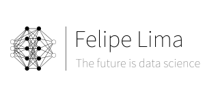

  

# Project :
- In this project, I created a recommendation system for medium posts. The web application searches for posts on the medium, processes the data, and goes through a machine learning model, where it recommends the best posts for you to read.
- The ensemble method was used for the machine learning solution, consisting of a Random Forest, lightGBM and Logistic Regression.

- [Webapp Link](https://posts-recommender-felipelima.herokuapp.com/)

  

# Project Motivation:

The moment of large volumes of data, makes us reflect now on how to present the best content. Every day I read at least two medium posts related to topics like machine learning, deep learning and data science. Researching the best posts to read takes a lot of time, and time is money. Based on that, I decided to create a web application, which searches for posts from the medium, cleans the data, and the machine learning model provides us with the best posts on the topic in question. Currently, the solution is having great results.

# Repository :
- Web App - The deploy folder contains all the files needed for deployment.
- Notebooks - The notebooks folder contains all the files needed to create the machine learning solution.

# Stack 
- Pandas: 1.0.3
- Numpy: 1.18.1
- Joblib: 0.14.1
- Sklearn: 0.22.2.post1
- LightGBM: 2.3.0
- Flask: 1.1.2
- Docker Container: 2.1.0.1 (37199)

Para mais informações da stack utilizada visite o arquivo requirements.txt

---

